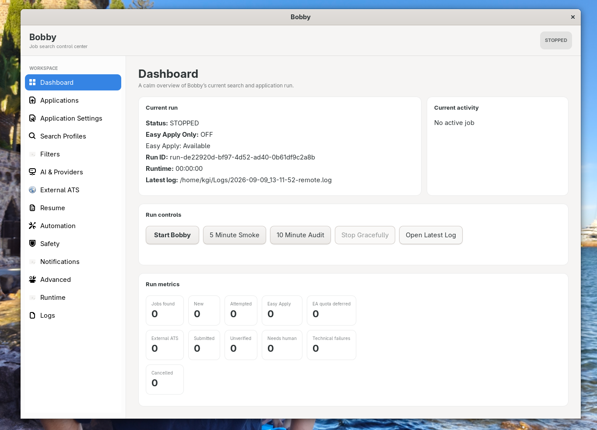
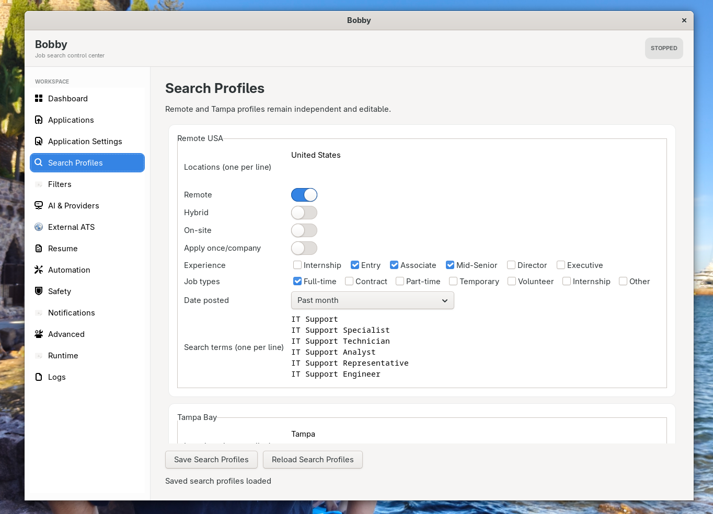

# Bobby — Open-Source Alpha

Bobby is an experimental, local-first, human-supervised job-application
assistant. It can search supported job sites, score opportunities, prepare
application material, and assist with Easy Apply workflows while keeping
submission decisions visible and auditable.

This is an active-development alpha. It is not a hosted service, a guarantee
of successful applications, or a replacement for reviewing every answer and
submission. Use a test account and synthetic data until you complete the
checks below.

## What works today

- LinkedIn and Indeed workflow foundations with configurable search criteria.
- LLM-assisted suitability and application-question handling.
- Resume and cover-letter generation paths.
- Durable application tracking, run IDs, redaction, and a local dashboard.
- A GTK control panel plus bounded provider fallback and submit-state checks.
- Experimental external ATS support behind explicit opt-in configuration.

The alpha has broad ATS detection and workflow code, but independent live
confirmation is limited. Treat Workday, Greenhouse, iCIMS, and ADP as
experimental observations, not compatibility guarantees. Other ATS paths are
subject to per-site verification.

## Proven in production

The private validation baseline behind this public alpha includes:

- A confirmed real external ATS submission in a controlled, human-supervised run.
- 1,300+ offline regression tests covering safety and workflow behavior.
- Duplicate-submit protection and durable submit-state checks.
- Provider fallback with bounded health and quota handling.
- An application tracker with run IDs, evidence fields, and redaction.

These results describe the current private validation baseline, not a promise
of universal ATS compatibility or unattended operation.

## Screenshots

The GTK control panel keeps the main workflow visible: run state, metrics,
search profiles, and safety controls are available from one local interface.





## Safety boundaries

The public example configuration enables `TEST_MODE` and
`EASY_APPLY_ONLY_MODE`; external ATS automation, automatic account creation,
Gmail verification, and resume uploads are disabled. Review generated
answers, documents, and the final submit state yourself.

Never commit `.env`, `candidate_profile.yaml`, browser state, resumes, logs,
application history, screenshots, or Gmail credentials. See
[SECURITY.md](SECURITY.md) before using real candidate data.

## Quick start (Linux)

The canonical development environment is Python 3.12.7 with `uv`.

```bash
git clone https://github.com/mrSlime-man/Bobby.git
cd Bobby
uv sync --locked
cp .env.example .env
cp candidate_profile.example.yaml candidate_profile.yaml
cp examples/data/resumes/structured_resume.yaml data/resumes/structured_resume.yaml
uv run python scripts/doctor.py
uv run python main.py
```

Replace every synthetic profile value and configure one supported LLM
provider before attempting a run. Keep the public example configuration in
test mode while learning the workflow. The dashboard is `uv run python
dashboard.py`; the GTK panel is `uv run python bobby_gui_launcher.py` on
systems with GTK 3 and PyGObject.

## Configuration and testing

Search criteria live in `config/search_config.yaml`. Candidate facts belong in
`candidate_profile.yaml`, while professional history belongs in the resume
source. Run `uv run python scripts/doctor.py` before a run.

```bash
uv run python -m compileall -q main.py src tests scripts
uv run pytest -q
```

Tests are offline and must not use real credentials, browsers, job sites, or
application submissions. See [ROADMAP.md](ROADMAP.md) for the next milestones.

## Contributing, credits, and license

See [CONTRIBUTING.md](CONTRIBUTING.md), [AGENTS.md](AGENTS.md), and
[CREDITS.md](CREDITS.md). The current release is `v0.1.0-alpha.1` and the
license is in [LICENSE](LICENSE).
